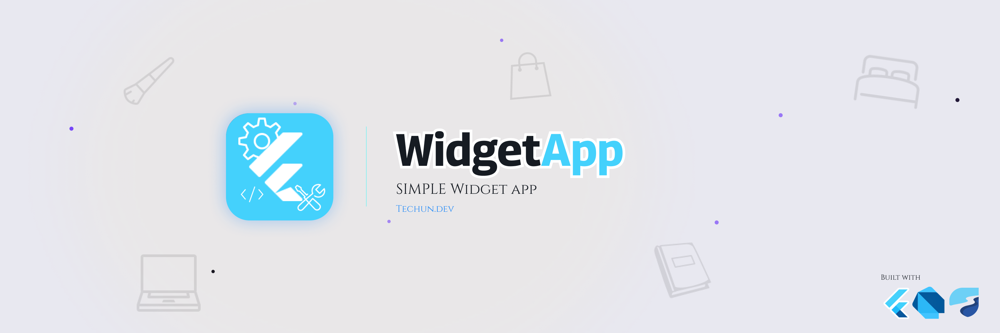

<p align="center">
  
</p>

<p align="center">
  
  
  
  
  
  
  
</p>

<br/>

# WIDGETS APP

Widgets App es una aplicación desarrollada en Flutter que reúne diferentes ejemplos de widgets, controles, animaciones y funcionalidades comunes para practicar y explorar el desarrollo de interfaces en Flutter. desarrollada por [Techun.dev](https://github.com/techundev)

---

## Tabla de Contenidos

- [Pantallas](#-pantallas)
- [Por qué este proyecto](#-por-qué-este-proyecto)
- [Stack Tecnológico](#-stack-tecnológico)
- [Configuración del Proyecto](#️-configuración-del-proyecto)
- [Descarga](#-descarga)
- [Desarrollador](#-desarrollador)
- [Licencia](#-licencia)

---

## Pantallas

| Pantalla | Descripción |
|---|---|
| **Riverpod Counter** | Ejemplo sencillo de manejo de estado utilizando Riverpod. |
| **Botones** | Muestra diferentes tipos de botones disponibles en Flutter. |
| **Tarjetas** | Ejemplo de tarjetas y contenedores estilizados. |
| **Progress Indicators** | Ejemplos de indicadores de progreso generales y controlables. |
| **Snackbars y diálogos** | Ejemplos de indicadores y mensajes mostrados en pantalla. |
| **Animated Container** | Ejemplo de un StatefulWidget utilizando un contenedor animado. |
| **UI Controls + Tiles** | Colección de diferentes controles y tiles disponibles en Flutter. |
| **Introducción a la aplicación** | Pequeño tutorial introductorio dentro de la aplicación. |
| **InfiniteScroll y Pull** | Ejemplo de listas infinitas y funcionalidad Pull to Refresh. |
| **Cambiar tema** | Permite cambiar el tema visual de la aplicación. |

### Vista previa

<p align="center">
  
</p>

---

## Por qué este proyecto

Widgets App es un proyecto orientado a la práctica y exploración de diferentes componentes y funcionalidades disponibles en Flutter.

La aplicación funciona como una colección de ejemplos independientes que permite revisar de forma práctica diferentes widgets, controles, animaciones, navegación, manejo de estado y funcionalidades comunes utilizadas durante el desarrollo de aplicaciones Flutter.

Algunos puntos que quise reforzar con este proyecto:

- Manejo de estado utilizando Riverpod.
- Navegación entre diferentes pantallas utilizando GoRouter.
- Creación y utilización de diferentes widgets de Flutter.
- Implementación de animaciones utilizando Animate Do.
- Implementación de listas infinitas y Pull to Refresh.
- Manejo de temas dentro de la aplicación.

---

## Stack Tecnológico

| Categoría | Tecnología |
|---|---|
| **Lenguaje** | Dart |
| **Framework UI** | Flutter |
| **Manejo de estado** | Flutter Riverpod |
| **Navegación** | GoRouter |
| **Animaciones** | Animate Do |
| **Linting** | Flutter Lints |
| **Testing** | Flutter Test |
| **Recursos** | Assets de imágenes |

### Dependencias principales

```yaml
dependencies:
  animate_do: ^5.1.0
  flutter:
    sdk: flutter
  flutter_riverpod: ^3.4.3
  go_router: ^18.0.1
```

---

## Configuración del Proyecto

### Requisitos

- Flutter SDK
- Dart SDK ^3.13.1
- Android Studio o Visual Studio Code
- Dispositivo físico o emulador Android/iOS

### Instalación

Clona el repositorio y accede al directorio del proyecto:

```bash
git clone https://github.com/techundev/FlutterWidgetApp.git
cd widgets_app
```

Instala las dependencias:

```bash
flutter pub get
```

Ejecuta la aplicación:

```bash
flutter run
```

El proyecto utiliza imágenes ubicadas dentro del directorio:

```text
assets/images/
```

---

## Descarga

¿Quieres probar la app sin compilar el proyecto? Descarga directamente el APK:

[](https://github.com/techundev/ExpenseTrackerApp/releases/download/v1.0.0/GastoDuo-v1.0.0.apk)

> **Nota:** Es necesario habilitar la instalación de fuentes desconocidas en tu dispositivo Android.
> `Ajustes → Seguridad → Instalar apps desconocidas`


---

## Desarrollador

Desarrollado por [Techun.dev](https://github.com/techundev).

---

## Licencia

Este proyecto es de uso personal y de libre consulta. Desarrollado
por [Techun.dev](https://github.com/techundev).
